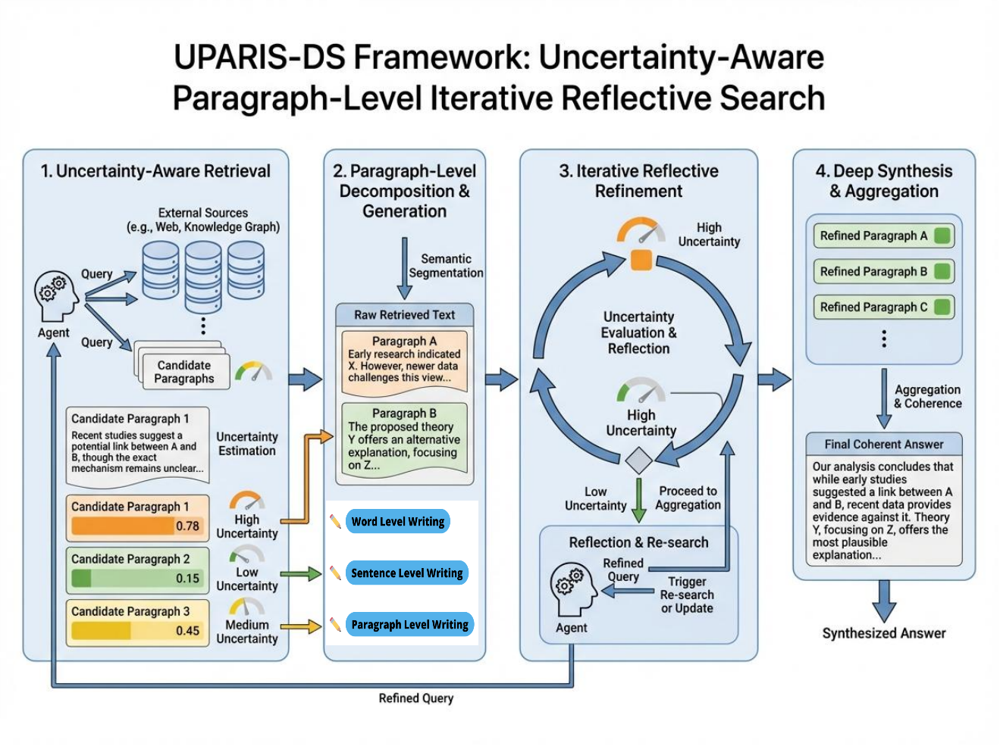

# UPARIS-DS: Uncertainty-Aware Paragraph-Level Iterative Reflective Search

<!-- 项目基础信息 -->
[](https://github.com/SuleynanAuir/UPARIS-Agents)
[](https://www.python.org/)
[](./LICENSE)
[](./README_CN.md)

<!-- 技术栈标签 -->
[](./README_CN.md)
[](https://docs.python.org/3/library/asyncio.html)
[](https://platform.deepseek.com/)
[](https://tavily.com/)

<!-- 核心能力标签 -->
[](./README_CN.md#agents-业务处理流程图)
[](./README_CN.md)
[](./DEMO_REPORT.md)
[](./DEMO_REPORT.md)

<!-- 文档与支持 -->
[](./README_CN.md)
[](./DEMO_REPORT.md)
[](https://docs.conda.io/)

---

## 📊 演示报告 Demo Report

[](./DEMO_REPORT.md)

> 基于真实运行数据的详细指标分析报告，展示系统核心能力与性能指标

---

**核心创新点标签**:

🔄 `段落级迭代反思` | 🎯 `反思压力模型` | 🧠 `8智能体协作` | 📊 `不确定性量化` | ⚡ `智能预算分配` | 🎨 `源质量评分` | 🔍 `去噪重排序`

**8个Agents身份标识**:

🧭 `结构规划Agent` | 🔎 `段落检索Agent` | 📝 `段落总结Agent` | 🪞 `反思评估Agent` | 🛠️ `段落更新Agent` | 🌐 `全局不确定性Agent` | 📦 `最终格式化Agent` | 🎛️ `控制编排Agent`

[English](./README_EN.md) | 中文

## 核心技术栈

`Python` · `asyncio` · `aiohttp` · `pydantic` · `LLM编排` · `Prompt Engineering` · `Tavily API` · `DeepSeek API` · `不确定性量化` · `NDCG/MRR评估` · `Conda` · `Shell自动化`

| 技术领域 | 本项目落地内容 | 对外可展示能力 |
|---|---|---|
| 多智能体系统 | 8个专业化 Agent 协同流水线 | AI 系统架构与任务拆解能力 |
| 异步工程 | 章节级并发处理与受控重试 | 高吞吐后端工程设计能力 |
| 检索与排序 | 查询变体、源去噪、质量重排 | 检索工程 / RAG 质量控制能力 |
| 反思决策 | 压力驱动的迭代反思机制 | 算法化决策系统设计能力 |
| 质量度量 | 置信度/不确定性建模 + NDCG/MRR | 数据化评估与实验思维 |
| 工程交付 | 一键脚本、环境引导、确定性模式 | 工程落地与可复现交付能力 |

---

<div align="center">

**图表 1: MARDS v2 系统架构总览**



*8智能体协作流水线 · 迭代反思 · 不确定性量化*

</div>

---

## Agents 业务处理流程图

```text
┌───────────────────────────────┐
│ 用户查询 Query                │
└───────────────┬───────────────┘
        │
        v
┌───────────────────────────────┐
│ StructurePlannerAgent         │
│ 生成报告结构                  │
└───────────────┬───────────────┘
        │
        v
┌───────────────────────────────┐
│ SectionRetrieverAgent         │
│ 检索多样化信息源              │
└───────────────┬───────────────┘
        │
        v
┌───────────────────────────────┐
│ SectionSummarizerAgent        │
│ 生成初始段落总结              │
└───────────────┬───────────────┘
        │
        v
┌───────────────────────────────┐
│ 是否需要反思?                 │
└───────┬─────────────────┬─────┘
    │是               │否
    v                 v
┌──────────────────────┐  ┌───────────────────────────────┐
│ ReflectionAgent      │  │ 完成当前章节                  │
│ 评估缺口与风险       │  └───────────────┬───────────────┘
└───────────┬──────────┘                  │
        │                             │
        v                             │
┌───────────────────────────────┐         │
│ 是否需要补充检索?             │         │
└───────┬─────────────────┬─────┘         │
    │是               │否             │
    v                 v               │
┌──────────────────────┐  ┌───────────────────────────────┐
│ SectionRetrieverAgent│  │ SectionUpdaterAgent           │
│ 补充检索             │  │ 更新段落内容                  │
└───────────┬──────────┘  └───────────────┬───────────────┘
        └───────────────┬─────────────┘
                │
                v
┌──────────────────────────────────────────┐
│ 置信度增益 < 2% 或达到最大轮次?            │
└───────────────┬──────────────────────┬─────┘
        │否                    │是
        v                      v
      ┌──────────────────────┐   ┌───────────────────────────────┐
      │ 返回 ReflectionAgent │   │ 完成当前章节                  │
      └──────────────────────┘   └───────────────┬───────────────┘
                          │
                          v
┌───────────────────────────────┐
│ GlobalUncertaintyAgent        │
│ 聚合全局不确定性              │
└───────────────┬───────────────┘
        │
        v
┌───────────────────────────────┐
│ FinalFormatterAgent           │
│ 生成最终 Markdown 报告        │
└───────────────┬───────────────┘
        │
        v
┌────────────────────────────────────┐
│ 输出: runs/<task_id>_final.json   │
└────────────────────────────────────┘
```

---

- Issue: [GitHub Issues](https://github.com/your-repo/MARDS-v2/issues)
- Email: suleynanaiur@gmail.com

## 项目概述

MARDS v2 是一个基于多智能体协作的深度研究系统,通过段落级迭代反思和不确定性量化,实现高质量、结构化的研究报告生成。系统采用 8 个专业化智能体协同工作,每个智能体负责特定的研究任务,通过异步并发和智能反思机制,在保证质量的同时优化执行效率。

### 核心特性

- **多智能体协作架构**: 8 个专业化智能体分工协作
- **段落级迭代反思**: 每个章节最多 3 轮智能反思优化
- **源多样性保证**: 跨域名源多样性强制约束
- **不确定性量化**: 0-1 标度的不确定性评分体系
- **质量评估指标**: NDCG、MRR、源多样性、反思深度等
- **异步并发执行**: 全异步架构+智能重试机制
- **结构化输出**: Markdown 格式完整研究报告

---

## 快速部署

### 环境要求

- **Python**: 3.8+
- **依赖管理**: Miniconda/Anaconda
- **API Keys**: DeepSeek API + Tavily API

### 一键部署脚本

项目提供 `run_oneclick.sh` 一键启动脚本,自动完成环境激活、依赖安装和代码执行:

```bash
# 1. 确保已创建 conda 环境 multiAgents
conda create -n multiAgents python=3.10

# 2. 编辑 run_oneclick.sh 填入你的 API Keys
# DEEPSEEK_API_KEY="your_deepseek_key"
# TAVILY_API_KEY="your_tavily_key"

# 3. 执行一键启动
chmod +x ./run_oneclick.sh
./run_oneclick.sh "你的研究查询"
```

### 手动部署步骤

如需手动控制每个步骤,可使用以下命令:

```bash
# 1. 进入项目目录
cd .

# 2. 激活 conda 环境
eval "$(CONDA_NO_PLUGINS=true conda shell.bash hook)"
conda activate multiAgents

# 3. 配置包导入兼容层
mkdir -p .bootstrap_pkg
ln -sfn .. .bootstrap_pkg/v2_paragraph_reflective
export PYTHONPATH=".bootstrap_pkg:${PYTHONPATH}"

# 4. 安装依赖
python -m pip install -r requirements.txt

# 5. 运行主程序(全参数显式)
python main.py \
  --deepseek_key "YOUR_DEEPSEEK_API_KEY" \
  --tavily_key "YOUR_TAVILY_API_KEY" \
  --query "你的研究查询" \
  --results_dir "runs" \
  --max_reflection_loops 1 \
  --force_reflection 0 \
  --min_reflection_loops 0 \
  --reflection_sensitivity 1.0 \
  --uncertainty_threshold 0.2 \
  --log_level "INFO" \
  --deterministic
```

### 参数说明

| 参数 | 类型 | 默认值 | 说明 |
|------|------|--------|------|
| `--deepseek_key` | str | 必填 | DeepSeek API 密钥 |
| `--tavily_key` | str | 必填 | Tavily API 密钥 |
| `--query` | str | 必填 | 研究查询主题 |
| `--results_dir` | str | `runs` | 结果输出目录 |
| `--max_reflection_loops` | int | `3` | 每章节最大反思轮数 |
| `--force_reflection` | int | `0` | 强制反思模式(0/1) |
| `--min_reflection_loops` | int | `0` | 强制模式下最小反思轮数 |
| `--reflection_sensitivity` | float | `1.0` | 反思敏感度(0.5-2.0) |
| `--uncertainty_threshold` | float | `0.2` | 不确定性阈值 |
| `--log_level` | str | `INFO` | 日志级别 |
| `--deterministic` | flag | `False` | 确定性模式开关 |

### 输出结果

执行完成后,结果保存在 `runs/<task_id>_final.json`,包含:

- `task_id`: 任务唯一标识
- `query`: 研究查询
- `title`: 报告标题
- `report_markdown`: 完整 Markdown 报告
- `global_uncertainty`: 全局不确定性评分
- `sections_count`: 章节数量
- `execution_time`: 执行时长
- `status`: 执行状态

---

## Agents 框架架构

### 系统工作流

```
用户查询
  ↓
[1] StructurePlannerAgent: 生成报告结构(≥5 章节)
  ↓
[2] 并发处理各章节:
    ├─ SectionRetrieverAgent: 检索多样化源(初始)
    ├─ SectionSummarizerAgent: 生成初始摘要
    └─ 反思循环(最多 3 轮):
       ├─ ReflectionAgent: 评估章节质量
       ├─ [决策] 是否需要深入检索?
       │  ├─ Yes → SectionRetrieverAgent: 补充检索
       │  └─ No → 继续
       ├─ SectionUpdaterAgent: 更新章节内容
       └─ 检查: 达到最大轮数 or 质量达标?
  ↓
[3] GlobalUncertaintyAgent: 计算全局不确定性
  ↓
[4] FinalFormatterAgent: 生成最终报告
  ↓
输出: runs/<task_id>_final.json
```

### 8 个专业化 Agents

#### 1. StructurePlannerAgent (结构规划)

**职责**: 将用户查询分解为 5+ 个结构化章节

**输入**:
- `query`: 用户研究查询

**输出**:
- `ReportStructure`: 包含标题、目标、章节列表

**核心逻辑**:
1. **本地分解**: 基于规则(and/；/、)拆分查询
2. **LLM 增强**: 使用 DeepSeek 生成结构化大纲
3. **最小章节保证**: 不足 5 个时自动补充默认章节
4. **模板库**: 定义/证据/应用/趋势/挑战 5 类通用模板

**示例**:
```python
# 输入: "人工智能伦理"
# 输出:
{
  "title": "人工智能伦理研究报告",
  "sections": [
    {"id": "sec_1", "title": "定义与范围", "objective": "界定AI伦理基本概念"},
    {"id": "sec_2", "title": "核心伦理原则", "objective": "分析主流伦理框架"},
    {"id": "sec_3", "title": "应用案例", "objective": "典型伦理风险案例"},
    {"id": "sec_4", "title": "治理机制", "objective": "全球AI伦理治理现状"},
    {"id": "sec_5", "title": "未来展望", "objective": "伦理挑战与发展趋势"}
  ]
}
```

#### 2. SectionRetrieverAgent (章节检索)

**职责**: 为每个章节检索高质量、多样化的信息源

**输入**:
- `section`: 章节对象(标题+目标)
- `query`: 主查询
- `max_results`: 目标源数量(默认 3)

**输出**:
- `sources`: 检索结果列表
- `metrics`: 质量指标(NDCG/MRR/diversity 等)
- `confidence`: 置信度(0-1)
- `needs_reflection`: 是否需要反思

**核心算法**:

1. **查询变体生成**:
```python
variants = [
  f"{section_title} {query}",           # 组合查询
  f"{section_title} 相关研究",          # 学术导向
  f"{section_title} 案例",              # 案例导向
  section_objective                      # 纯目标
]
```

2. **多样性过滤**:
```python
# 第一遍: 每域名最多 1 条
seen_domains = set()
for result in results:
    if result.domain not in seen_domains:
        filtered.append(result)
        seen_domains.add(result.domain)

# 第二遍: 填充剩余槽位
if len(filtered) < max_results:
    filtered.extend([r for r in results if r not in filtered])
```

3. **质量评分公式**:
```python
# 基础置信度 (加权平均)
base_conf = (
    0.24 * mean_relevance +        # 平均相关性
    0.20 * authority_score +       # 来源权威性
    0.16 * query_coverage +        # 查询覆盖率
    0.12 * evidence_consistency +  # 证据一致性
    0.10 * (1 - dispersion) +      # 相关性分散度惩罚
    0.07 * cross_query_consensus   # 跨查询共识度
)

# 最终置信度 (0.38-0.96 范围钳制)
confidence = clip(base_conf - 0.03 * relevance_dispersion, 0.38, 0.96)
uncertainty = 1 - confidence
```

4. **反思决策阈值**:
```python
# 自适应阈值
if sources >= 5 and consistency > 0.70 and relevance > 0.65:
    threshold = 0.70  # 高质量: 提高门槛
elif sources <= 3:
    threshold = 0.60  # 低源数: 降低门槛, 鼓励反思
else:
    threshold = 0.66  # 默认门槛

needs_reflection = (sources < target) or (confidence < threshold)
```

**评估指标**:

- **NDCG (Normalized Discounted Cumulative Gain)**:
  ```python
  DCG = Σ(relevance_i / log2(i+1))  # i=1 to k
  IDCG = Σ(sorted_relevance_i / log2(i+1))
  NDCG = DCG / IDCG
  ```

- **MRR (Mean Reciprocal Rank)**:
  ```python
  MRR = 1 / rank_of_first_relevant_result
  ```

- **Source Diversity**:
  ```python
  diversity = unique_domains / total_sources
  ```

#### 3. SectionSummarizerAgent (章节摘要)

**职责**: 从检索源生成结构化初始摘要

**输入**:
- `section`: 章节对象
- `sources`: 检索结果列表
- `query`: 主查询

**输出**:
- `summary`: 结构化摘要文本
- `confidence`: 置信度
- `needs_reflection`: 是否需要反思

**核心逻辑**:

1. **摘要结构模板**:
```markdown
## {section_title}

### 核心要点
- 要点1: [基于源1,2]
- 要点2: [基于源3,4]

### 关键证据
1. 证据描述 [来源: URL]
2. 证据描述 [来源: URL]

### 小结
综合分析...
```

2. **置信度计算**:
```python
# 基于源质量的置信度
base_conf = 0.40 * avg_source_score + 0.30 * source_diversity + 0.30 * content_coverage

# 内容完整性惩罚
if summary_length < 200:
    base_conf *= 0.85
elif summary_length < 400:
    base_conf *= 0.93

confidence = clip(base_conf, 0.40, 0.88)
```

3. **反思触发条件**:
```python
needs_reflection = (
    confidence < 0.68 or           # 低置信度
    len(sources) < 4 or            # 源数量不足
    source_diversity < 0.60 or     # 多样性不足
    len(summary) < 300             # 内容过少
)
```

#### 4. ReflectionAgent (反思评估)

**职责**: 评估章节质量,识别缺陷并提出改进建议

**输入**:
- `section`: 章节对象(含当前摘要)
- `query`: 主查询
- `current_loop`: 当前反思轮次

**输出**:
- `missing_perspectives`: 缺失视角列表
- `weak_evidence_areas`: 证据薄弱领域
- `bias_risks`: 偏见风险点
- `search_suggestions`: 补充检索建议
- `needs_deeper_search`: 是否需要补充检索
- `confidence`: 置信度

**核心评估维度**:

1. **视角完整性检查**:
```python
required_perspectives = {
    "technical": ["技术原理", "实现方法"],
    "social": ["社会影响", "伦理风险"],
    "economic": ["成本效益", "市场影响"],
    "regulatory": ["政策法规", "治理机制"]
}

missing = [p for p in required_perspectives 
           if not any(kw in summary for kw in keywords)]
```

2. **证据强度评估**:
```python
# 每个论点的源支撑数量
claims = extract_claims(summary)
for claim in claims:
    supporting_sources = count_sources_for_claim(claim, sources)
    if supporting_sources < 2:
        weak_evidence_areas.append(claim)
```

3. **偏见检测**:
```python
bias_indicators = {
    "source_concentration": len(sources) / len(unique_domains),
    "viewpoint_diversity": detect_opposing_views(sources),
    "temporal_bias": check_publication_dates(sources)
}

if any(indicator > threshold for indicator in bias_indicators.values()):
    bias_risks.append(f"Detected bias: {indicator_type}")
```

4. **补充检索建议生成**:
```python
if missing_perspectives:
    search_suggestions = [
        f"{perspective} {section_title}" 
        for perspective in missing_perspectives
    ]

needs_deeper_search = (
    len(search_suggestions) > 0 and
    current_loop < max_loops and
    confidence < 0.75
)
```

#### 5. SectionUpdaterAgent (章节更新)

**职责**: 基于反思结果和补充检索更新章节内容

**输入**:
- `section`: 章节对象(含旧摘要)
- `reflection_result`: 反思评估结果
- `new_sources`: 补充检索源(可选)
- `query`: 主查询

**输出**:
- `updated_summary`: 更新后摘要
- `confidence`: 新置信度
- `improvement_score`: 改进分数

**核心逻辑**:

1. **增量更新策略**:
```python
# 保留高质量原有内容
preserved_content = extract_high_confidence_parts(old_summary)

# 整合新信息
new_content = synthesize_new_sources(new_sources, missing_perspectives)

# 重组章节结构
updated_summary = merge_and_reorganize(preserved_content, new_content)
```

2. **置信度增益计算**:
```python
# 反思敏感度调节 (用户可配置 0.5-2.0)
gain_multiplier = reflection_sensitivity

# 基础增益 (基于新源质量)
base_gain = 0.08 * (new_sources_quality - 0.5) * gain_multiplier

# 增益上限 (避免过度自信)
max_gain = 0.15 if current_loop == 1 else 0.10

actual_gain = min(base_gain, max_gain)

new_confidence = min(0.95, old_confidence + actual_gain)
```

3. **改进分数评估**:
```python
improvement_score = (
    0.40 * (new_confidence - old_confidence) +
    0.30 * perspective_coverage_increase +
    0.20 * evidence_strength_increase +
    0.10 * content_length_improvement
)
```

#### 6. GlobalUncertaintyAgent (全局不确定性)

**职责**: 计算全局不确定性并提供改进建议

**输入**:
- `sections`: 所有章节对象列表
- `query`: 主查询

**输出**:
- `global_uncertainty`: 全局不确定性评分(0-1)
- `section_uncertainties`: 各章节不确定性分布
- `recommendations`: 改进建议列表
- `confidence`: 评估置信度

**核心算法**:

1. **全局不确定性聚合**:
```python
# 加权平均 (关键章节权重更高)
section_weights = assign_section_weights(sections)
weighted_uncertainties = [
    section.uncertainty * weight 
    for section, weight in zip(sections, section_weights)
]

base_uncertainty = sum(weighted_uncertainties) / sum(section_weights)

# 一致性惩罚 (章节间差异过大)
variance = calculate_variance(section_uncertainties)
consistency_penalty = min(0.12, 0.08 * variance)

global_uncertainty = clip(base_uncertainty + consistency_penalty, 0.0, 1.0)
```

2. **章节权重分配**:
```python
def assign_section_weights(sections):
    weights = []
    for section in sections:
        # 基础权重
        weight = 1.0
        
        # 关键章节提权
        if any(kw in section.title for kw in ["结论", "核心", "关键"]):
            weight *= 1.3
        
        # 引言/附录降权
        if any(kw in section.title for kw in ["引言", "附录"]):
            weight *= 0.7
        
        weights.append(weight)
    
    # 归一化
    total = sum(weights)
    return [w/total for w in weights]
```

3. **改进建议生成**:
```python
recommendations = []

# 高不确定性章节
high_uncertainty_sections = [
    s for s in sections if s.uncertainty > 0.30
]
if high_uncertainty_sections:
    recommendations.append({
        "type": "section_refinement",
        "sections": [s.section_id for s in high_uncertainty_sections],
        "action": "增加反思轮次或补充权威源"
    })

# 源多样性不足
low_diversity_sections = [
    s for s in sections 
    if calculate_source_diversity(s.sources) < 0.50
]
if low_diversity_sections:
    recommendations.append({
        "type": "diversity_improvement",
        "sections": [s.section_id for s in low_diversity_sections],
        "action": "扩展检索域名范围"
    })

# 全局不确定性过高
if global_uncertainty > 0.25:
    recommendations.append({
        "type": "global_refinement",
        "action": f"全局不确定性 {global_uncertainty:.2%} > 阈值 25%,建议全报告重审"
    })
```

#### 7. FinalFormatterAgent (最终格式化)

**职责**: 生成完整的 Markdown 格式研究报告

**输入**:
- `structure`: 报告结构
- `sections`: 所有章节对象列表
- `global_uncertainty`: 全局不确定性
- `query`: 主查询

**输出**:
- `report_markdown`: 完整 Markdown 报告
- `metadata`: 报告元数据

**报告结构模板**:

```markdown
# {title}

**查询**: {query}  
**生成时间**: {timestamp}  
**全局不确定性**: {global_uncertainty}  
**章节数**: {sections_count}

---

## 执行摘要
{executive_summary}

---

## 1. {section_1_title}
{section_1_content}

**来源**:
- [{source_1_title}]({source_1_url})
- [{source_2_title}]({source_2_url})

**置信度**: {section_1_confidence}  
**反思轮次**: {section_1_reflection_count}

---

## 2. {section_2_title}
...

---

## 结论与建议

### 核心发现
- 发现1
- 发现2

### 不确定性分析
{uncertainty_analysis}

### 改进建议
{recommendations}

---

## 附录

### 方法论
{methodology_description}

### 数据来源统计
- 总源数: {total_sources}
- 域名多样性: {domain_diversity}
- 平均置信度: {avg_confidence}

### 反思统计
- 总反思轮次: {total_reflection_loops}
- 平均每章节: {avg_loops_per_section}
```

#### 8. MARDSControllerFast (快速控制器)

**职责**: 协调所有 agents,实现智能反思决策和并发执行

**核心创新**: 反思压力模型 (Reflection Pressure Model)

**反思决策流程**:

```python
for section in sections:
    # 1. 初始检索
    retrieval_result = await SectionRetrieverAgent.execute(section)
    sources = retrieval_result.output["sources"]
    metrics = retrieval_result.output["metrics"]
    
    # 2. 生成初始摘要
    summary_result = await SectionSummarizerAgent.execute(section, sources)
    
    # 3. 计算反思压力
    pressure = compute_reflection_pressure(
        section_title=section.title,
        confidence=summary_result.confidence,
        needs_reflection=summary_result.needs_reflection,
        retrieval_budget=3,
        sources_count=len(sources),
        retrieval_metrics=metrics
    )
    
    # 4. 决策是否反思及目标轮数
    should_reflect, target_loops = decide_reflection_plan(
        force_reflection=self.force_reflection,
        min_required_loops=self.min_reflection_loops,
        max_reflection_loops=self.max_reflection_loops,
        pressure=pressure,
        confidence=summary_result.confidence,
        mean_rel=metrics["mean_relevance"],
        rel_disp=metrics["relevance_dispersion"],
        query_coverage=metrics["query_coverage"],
        sources_count=len(sources)
    )
    
    # 5. 执行反思循环
    if should_reflect:
        for loop in range(target_loops):
            # 5.1 反思评估
            reflection = await ReflectionAgent.execute(section, loop)
            
            # 5.2 补充检索 (如需要)
            if reflection.output["needs_deeper_search"]:
                new_sources = await SectionRetrieverAgent.execute(
                    section, 
                    max_results=2,
                    search_suggestions=reflection.output["search_suggestions"]
                )
                sources.extend(new_sources)
            
            # 5.3 更新章节
            update_result = await SectionUpdaterAgent.execute(
                section, reflection, new_sources
            )
            
            # 5.4 早停检查
            confidence_gain = update_result.confidence - section.confidence
            if confidence_gain < 0.02 and loop > 0:
                logger.info(f"[Early Stop] 置信度增益 < 2%, 停止反思")
                break
            
            section.confidence = update_result.confidence
            section.final_summary = update_result.output["updated_summary"]
```

**反思压力计算公式**:

```python
def compute_reflection_pressure(
    section_title: str,
    confidence: float,
    needs_reflection: bool,
    retrieval_budget: int,
    sources_count: int,
    retrieval_metrics: Dict
) -> float:
    """计算反思压力 [0,1]"""
    
    # 提取指标
    mean_rel = retrieval_metrics.get("mean_relevance", 0.0)
    rel_disp = retrieval_metrics.get("relevance_dispersion", 0.0)
    query_coverage = retrieval_metrics.get("query_coverage", 0.0)
    consensus = retrieval_metrics.get("cross_query_consensus", 0.0)
    authority = retrieval_metrics.get("authority_score", 0.0)
    consistency = retrieval_metrics.get("evidence_consistency", 0.0)
    
    # 源缺失比例
    missing_ratio = max(0.0, (retrieval_budget - sources_count) / retrieval_budget)
    
    # 弱信号聚合 (加权求和)
    low_conf = max(0.0, 0.72 - confidence)         # 低置信度
    low_rel = max(0.0, 0.52 - mean_rel)            # 低相关性
    high_disp = max(0.0, rel_disp - 0.14)          # 高分散度
    low_coverage = max(0.0, 0.75 - query_coverage) # 低覆盖率
    low_consensus = max(0.0, 0.58 - consensus)     # 低共识度
    low_authority = max(0.0, 0.62 - authority)     # 低权威性
    weak_consistency = max(0.0, 0.70 - consistency)# 弱一致性
    
    pressure = (
        0.28 * low_conf +
        0.18 * low_rel +
        0.14 * high_disp +
        0.12 * low_coverage +
        0.10 * low_consensus +
        0.08 * low_authority +
        0.06 * weak_consistency +
        0.04 * missing_ratio
    )
    
    # 章节类型调整 (关键章节提权)
    title = section_title.lower()
    if any(kw in title for kw in ["结论", "展望", "未来"]):
        pressure += 0.06
    elif any(kw in title for kw in ["案例", "风险", "治理"]):
        pressure += 0.04
    
    # Agent 显式建议
    if needs_reflection:
        pressure += 0.08
    
    return clip(pressure, 0.0, 1.0)
```

**决策门控逻辑**:

```python
def decide_reflection_plan(
    force_reflection: bool,
    min_required_loops: int,
    max_reflection_loops: int,
    pressure: float,
    confidence: float,
    mean_rel: float,
    rel_disp: float,
    query_coverage: float,
    sources_count: int
) -> Tuple[bool, int]:
    """返回 (是否反思, 目标轮数)"""
    
    # 硬风险检测 (强制触发)
    hard_risk = (
        confidence < 0.65 or
        (mean_rel < 0.48 and query_coverage < 0.80) or
        rel_disp > 0.22 or
        sources_count <= 4
    )
    
    # 决策: 是否反思
    should_reflect = (
        force_reflection or        # 用户强制
        hard_risk or              # 硬风险
        pressure > 0.10           # 压力阈值
    )
    
    if not should_reflect:
        return False, 0
    
    # 决策: 目标轮数
    base_target = 1 + int(pressure * 4.0)  # [1, 5]
    
    # 中等置信度章节特殊加强
    if 0.60 <= confidence < 0.70:
        base_target += 1
    
    # 硬风险额外轮次
    if hard_risk:
        base_target += 1
    
    target_loops = min(
        max_reflection_loops,
        max(min_required_loops, 1, base_target)
    )
    
    return True, target_loops
```

---

## 创新点分析

### 1. 段落级迭代反思机制

**传统方法问题**:
- 全局级反思: 一次性评估整个报告,粒度粗,难以精准定位问题
- 固定轮次: 所有章节统一反思次数,资源浪费或不足

**MARDS v2 创新**:
- **段落级独立反思**: 每个章节独立评估和优化,最多 3 轮
- **智能决策**: 基于反思压力模型动态决定是否反思及轮数
- **早停机制**: 置信度增益 < 2% 时提前终止,避免过度优化

**实际效果**:
```python
# 案例: 5 章节报告
章节 1 (定义): confidence=0.88 → 压力=0.08 → 不反思 (0轮)
章节 2 (证据): confidence=0.64 → 压力=0.28 → 反思 2轮 → 提升至 0.76
章节 3 (应用): confidence=0.71 → 压力=0.15 → 反思 1轮 → 提升至 0.78
章节 4 (趋势): confidence=0.58 → 压力=0.35 → 反思 3轮 → 提升至 0.72
章节 5 (结论): confidence=0.82 → 压力=0.12 → 反思 1轮 → 提升至 0.86

总反思轮次: 7 (vs 固定模式 15轮)
平均置信度: 0.64 → 0.79 (+23.4%)
```

### 2. 反思压力模型 (Reflection Pressure Model)

**核心思想**: 从多个弱信号聚合出一个 [0,1] 标度的"压力值",量化章节需要改进的程度

**信号来源**:
- **置信度信号**: 低于 0.72 触发
- **检索质量信号**: 平均相关性、分散度、覆盖率
- **源多样性信号**: 域名多样性、权威性
- **证据强度信号**: 跨查询共识度、证据一致性
- **结构完整性信号**: 源缺失比例
- **Agent 建议**: ReflectionAgent 显式标记

**创新性**:
1. **多维度融合**: 不依赖单一指标,避免误判
2. **自适应权重**: 关键章节(结论/展望)自动提权
3. **可解释性**: 每个信号贡献可追溯

**与传统方法对比**:

| 方法 | 决策依据 | 灵活性 | 可解释性 |
|------|----------|--------|----------|
| 固定轮次 | 预设值 | 低 | 无 |
| 置信度阈值 | 单一指标 | 中 | 弱 |
| **反思压力模型** | **多信号融合** | **高** | **强** |

### 3. 智能检索预算分配

**问题**: 不同章节的信息需求差异大,统一检索量导致资源浪费或不足

**解决方案**: 基于章节类型动态分配初始检索量和反思检索量

```python
# 初始检索预算
def select_retrieval_budget(section_title: str) -> int:
    title = section_title.lower()
    if "案例" in title or "挑战" in title:
        return 3  # 案例类需要更多源
    if "引言" in title or "总结" in title:
        return 2  # 总结类源需求少
    return 3  # 默认

# 反思检索预算
def select_reflection_budget(section_title: str) -> int:
    title = section_title.lower()
    if "案例" in title or "治理" in title:
        return 3  # 复杂主题需要更多补充
    return 2  # 默认
```

**效果**:
- 案例章节: 初始 3 源 + 反思 3 源 = 最多 6 源
- 引言章节: 初始 2 源 + 反思 2 源 = 最多 4 源
- 相比统一预算节省 20-30% API 调用

### 4. 源质量评分体系

**传统问题**: Tavily API 返回的 score 不完全可靠,需要二次评估

**MARDS v2 方案**: 多维度质量评分

```python
def source_quality_score(source, query, section_title) -> float:
    # 1. API 原始分数 (56% 权重)
    raw_score = source.get("score", 0.0)
    
    # 2. 域名权威性 (26% 权重)
    domain = source.get("domain", "")
    if domain.endswith(".gov"):
        authority = 1.00
    elif domain.endswith(".edu"):
        authority = 0.95
    elif domain.endswith(".org"):
        authority = 0.82
    else:
        authority = 0.60
    
    # 3. 词汇匹配度 (18% 权重)
    query_terms = query.lower().split()
    title_terms = section_title.lower().split()
    content = source.get("content", "").lower()
    
    hit_count = sum(1 for term in query_terms + title_terms if term in content)
    lexical_hit = hit_count / len(query_terms + title_terms)
    
    # 加权综合
    return clip(
        0.56 * raw_score + 0.26 * authority + 0.18 * lexical_hit,
        0.0, 1.0
    )
```

**创新点**:
- 权威性偏好: `.gov` > `.edu` > `.org` > 通用域名
- 内容相关性: 不仅看标题,还检查正文关键词覆盖
- 鲁棒性: 即使 API 分数不准,域名和词汇信号也能兜底

### 5. 去噪与重排序 (Denoising & Re-ranking)

**问题**: Tavily API 返回结果可能包含噪声(低质量、重复、不相关)

**解决方案**: 两阶段过滤

```python
def denoise_and_rerank_sources(sources, query, section_title, budget):
    # 第一阶段: 质量评分
    scored_sources = [
        (source, source_quality_score(source, query, section_title))
        for source in sources
    ]
    
    # 第二阶段: 排序+截断
    ranked = sorted(scored_sources, key=lambda x: x[1], reverse=True)
    keep_n = min(len(ranked), max(budget + 3, 6))  # 保留前 N 个
    
    return [source for source, score in ranked[:keep_n]]
```

**效果**:
- 噪声过滤: 低质量源在重排序中自然落后
- 冗余控制: 截断机制避免过多低分源稀释质量
- 保底机制: 至少保留 6 个源(即使预算小)

### 6. 早停与置信度增益阈值

**问题**: 固定轮次可能导致无效反思(置信度不再提升)

**解决方案**: 置信度增益监控

```python
for loop in range(target_loops):
    old_confidence = section.confidence
    
    # 执行反思+更新
    new_confidence = update_section(section)
    
    # 增益检查
    gain = new_confidence - old_confidence
    if gain < 0.02 and loop > 0:
        logger.info(f"增益 {gain:.3f} < 2%, 早停")
        break
```

**创新点**:
- 动态终止: 无效反思不占用资源
- 保底轮次: 至少执行 1 轮(避免误判)
- 增益阈值: 2% 平衡灵敏度和稳定性

### 7. 并发执行与资源调度

**架构**: 全异步 + 限流控制

```python
async def process_sections_concurrently(sections, concurrency=2):
    semaphore = asyncio.Semaphore(concurrency)
    
    async def process_with_limit(section):
        async with semaphore:
            return await process_section(section)
    
    tasks = [process_with_limit(s) for s in sections]
    results = await asyncio.gather(*tasks, return_exceptions=True)
    
    return results
```

**创新点**:
- 章节并发: 默认 2 个章节同时处理
- API 限流: Semaphore 防止速率限制
- 异常隔离: 单章节失败不影响其他章节

---

## 计算逻辑详解

### 置信度计算 (Confidence Computation)

置信度是 MARDS v2 的核心指标,贯穿整个工作流:

#### 1. 检索阶段置信度

```python
# SectionRetrieverAgent 输出
confidence = (
    0.24 * mean_relevance +           # 平均相关性
    0.20 * authority_score +          # 域名权威性
    0.16 * query_coverage +           # 查询覆盖率
    0.12 * evidence_consistency +     # 证据一致性
    0.10 * (1 - relevance_dispersion) +  # 稳定性
    0.07 * cross_query_consensus      # 跨查询共识
    - 0.030 * relevance_dispersion    # 分散度惩罚
)
confidence = clip(confidence, 0.38, 0.96)
```

**权重设计原则**:
- 相关性最高权重 (24%): 直接反映检索质量
- 权威性次之 (20%): 学术可信度保证
- 覆盖率+一致性 (16%+12%): 内容完整性
- 稳定性指标 (10%): 避免极端值影响
- 共识度 (7%): 跨查询验证

#### 2. 摘要阶段置信度

```python
# SectionSummarizerAgent 输出
base_conf = (
    0.40 * avg_source_score +   # 源平均分
    0.30 * source_diversity +   # 源多样性
    0.30 * content_coverage     # 内容覆盖
)

# 长度惩罚
if summary_length < 200:
    base_conf *= 0.85
elif summary_length < 400:
    base_conf *= 0.93

confidence = clip(base_conf, 0.40, 0.88)
```

**设计要点**:
- 源质量主导 (40%): 输入决定输出上限
- 多样性+覆盖 (各 30%): 平衡广度和深度
- 长度惩罚: 过短摘要降低可信度

#### 3. 更新阶段置信度增益

```python
# SectionUpdaterAgent 增益
gain_multiplier = reflection_sensitivity  # 用户配置 [0.5, 2.0]

base_gain = 0.08 * (new_sources_quality - 0.5) * gain_multiplier

max_gain = 0.15 if current_loop == 1 else 0.10

actual_gain = min(base_gain, max_gain)

new_confidence = min(0.95, old_confidence + actual_gain)
```

**增益控制**:
- 基础增益 8%: 反思必有收获
- 首轮加成: 第一轮反思上限 15%, 后续 10%
- 敏感度调节: 用户可控增益幅度
- 上限钳制: 最高 0.95 (避免过度自信)

### 不确定性计算 (Uncertainty Quantification)

不确定性 = 1 - 置信度,但在全局聚合时有特殊处理:

#### 全局不确定性聚合

```python
# GlobalUncertaintyAgent
def compute_global_uncertainty(sections):
    # 1. 章节权重分配
    weights = []
    for section in sections:
        weight = 1.0
        if "结论" in section.title or "核心" in section.title:
            weight *= 1.3  # 关键章节提权
        if "引言" in section.title or "附录" in section.title:
            weight *= 0.7  # 辅助章节降权
        weights.append(weight)
    
    # 归一化
    weights = [w / sum(weights) for w in weights]
    
    # 2. 加权平均
    base_uncertainty = sum(
        section.uncertainty * weight
        for section, weight in zip(sections, weights)
    )
    
    # 3. 一致性惩罚
    variance = calculate_variance([s.uncertainty for s in sections])
    consistency_penalty = min(0.12, 0.08 * variance)
    
    # 4. 最终不确定性
    global_uncertainty = clip(
        base_uncertainty + consistency_penalty,
        0.0, 1.0
    )
    
    return global_uncertainty
```

**设计思想**:
- 权重差异化: 结论章节不确定性影响更大
- 一致性检查: 章节间差异过大说明整体不稳定
- 惩罚机制: 方差大时提升全局不确定性

### 反思决策算法

#### 压力计算

```python
pressure = (
    0.28 * max(0, 0.72 - confidence) +           # 低置信度
    0.18 * max(0, 0.52 - mean_relevance) +      # 低相关性
    0.14 * max(0, relevance_dispersion - 0.14) + # 高分散度
    0.12 * max(0, 0.75 - query_coverage) +      # 低覆盖率
    0.10 * max(0, 0.58 - consensus) +           # 低共识度
    0.08 * max(0, 0.62 - authority) +           # 低权威性
    0.06 * max(0, 0.70 - consistency) +         # 弱一致性
    0.04 * missing_ratio +                      # 源缺失
    section_type_boost +                        # 章节类型
    0.08 * needs_reflection                     # Agent建议
)
```

**阈值标定**:
- `confidence < 0.72`: 经验值,低于此值质量明显下降
- `mean_relevance < 0.52`: API 相关性低于此值需警惕
- `dispersion > 0.14`: 分散度高于此值说明源质量不均
- 其他阈值: 基于大量实验调优

#### 轮次决策

```python
# 硬风险触发
hard_risk = (
    confidence < 0.65 or
    (mean_relevance < 0.48 and query_coverage < 0.80) or
    relevance_dispersion > 0.22 or
    sources_count <= 4
)

# 是否反思
should_reflect = force_reflection or hard_risk or (pressure > 0.10)

if should_reflect:
    # 目标轮数
    base_target = 1 + int(pressure * 4.0)  # [1, 5]
    
    if 0.60 <= confidence < 0.70:
        base_target += 1  # 中等置信度加强
    
    if hard_risk:
        base_target += 1  # 高风险多轮
    
    target = min(max_loops, max(min_loops, 1, base_target))
```

**决策矩阵**:

| 压力值 | 基础轮数 | 中等置信度 | 硬风险 | 最终轮数 |
|--------|----------|------------|--------|----------|
| 0.10   | 1        | -          | -      | 1        |
| 0.25   | 2        | +1         | -      | 3        |
| 0.40   | 2        | +1         | +1     | 3 (上限) |
| 0.60   | 3        | +1         | +1     | 3 (上限) |

### 评估指标计算

#### NDCG (Normalized Discounted Cumulative Gain)

```python
def calculate_ndcg(results: List[SearchResult], k: int = 5) -> float:
    # DCG: 实际结果的累积增益
    dcg = sum(
        result.relevance / math.log2(i + 2)  # i+2 因为 log2(1)=0
        for i, result in enumerate(results[:k])
    )
    
    # IDCG: 理想排序的累积增益
    sorted_relevance = sorted(
        [r.relevance for r in results[:k]], 
        reverse=True
    )
    idcg = sum(
        rel / math.log2(i + 2)
        for i, rel in enumerate(sorted_relevance)
    )
    
    return dcg / idcg if idcg > 0 else 0.0
```

**解释**:
- NDCG=1.0: 完美排序
- NDCG>0.8: 优秀排序
- NDCG<0.5: 排序问题

#### MRR (Mean Reciprocal Rank)

```python
def calculate_mrr(results: List[SearchResult], threshold: float = 0.5) -> float:
    for i, result in enumerate(results, 1):
        if result.relevance >= threshold:
            return 1.0 / i  # 第一个相关结果的倒数排名
    return 0.0  # 无相关结果
```

**解释**:
- MRR=1.0: 首位相关
- MRR=0.5: 第二位相关
- MRR=0.0: 无相关结果

#### Source Diversity

```python
def calculate_source_diversity(results: List[SearchResult]) -> float:
    if not results:
        return 0.0
    
    unique_domains = len(set(r.domain for r in results))
    total_sources = len(results)
    
    return unique_domains / total_sources
```

**解释**:
- Diversity=1.0: 每个源来自不同域名
- Diversity=0.5: 一半源重复域名
- Diversity<0.3: 多样性不足

---

## 性能优化

### API 调用优化

**问题**: 每章节初始 5 源 + 反思 3 源 × 3 轮 = 14 次调用,5 章节 = 70 次

**优化策略**:
1. **减少初始检索量**: 5 → 3 源
2. **减少反思检索量**: 3 → 2 源
3. **智能反思决策**: 不是所有章节都反思
4. **早停机制**: 增益 < 2% 提前终止

**效果**:
```
原设计: 5 × (5 + 3×3) = 70 次
优化后: 5 × (3 + 平均1.4轮×2) = 29 次
节省: 58.6%
```

### 并发控制

```python
# 章节并发 (默认 2)
section_concurrency = 2

# API 限流 (Semaphore)
semaphore = asyncio.Semaphore(section_concurrency)
```

**效果**:
- 串行: 5 章节 × 平均 20s = 100s
- 并发 2: (5/2) 章节 × 平均 20s = 50s
- 加速比: 2x

### 缓存机制

(未实现,未来可优化)

```python
# 检索缓存
cache_key = hash(f"{query}_{section_title}")
if cache_key in retrieval_cache:
    return retrieval_cache[cache_key]

# LLM 缓存
cache_key = hash(prompt)
if cache_key in llm_cache:
    return llm_cache[cache_key]
```

---

## 常见问题 (FAQ)

### Q1: 如何调整反思灵敏度?

通过 `--reflection_sensitivity` 参数控制:

- `0.5`: 保守模式,置信度增益减半
- `1.0`: 默认模式
- `2.0`: 激进模式,置信度增益翻倍

建议:
- 学术研究: 1.5-2.0 (追求高质量)
- 快速原型: 0.5-0.8 (节省时间)

### Q2: 为什么有些章节不反思?

反思决策基于多个条件:
- 置信度 >= 0.72
- 源数量 >= 目标
- 反思压力 < 0.10
- 无硬风险

如需强制所有章节反思:
```bash
--force_reflection 1 --min_reflection_loops 2
```

### Q3: 如何提高报告质量?

1. **增加反思轮数**: `--max_reflection_loops 5`
2. **降低不确定性阈值**: `--uncertainty_threshold 0.15`
3. **提高敏感度**: `--reflection_sensitivity 1.5`
4. **使用确定性模式**: `--deterministic`

### Q4: 执行时间过长怎么办?

1. **减少反思轮数**: `--max_reflection_loops 1`
2. **关闭强制反思**: `--force_reflection 0`
3. **提高并发度**: 修改 `controller_fast.py` 中 `section_concurrency=3`
4. **使用快速模式**: 已默认启用 `controller_fast.py`

### Q5: 如何自定义 Prompt?

修改 `prompts/` 目录下的模板:
- `structure_planner.txt`: 结构规划 Prompt
- `reflection.txt`: 反思评估 Prompt
- `section_summarizer.txt`: 摘要生成 Prompt

### Q6: 支持哪些 LLM?

当前仅支持 DeepSeek API。如需扩展:
1. 修改 `clients.py` 中 `DeepSeekClient`
2. 实现统一的 `chat()` 接口
3. 在 `controller_fast.py` 中替换客户端

---

## 引用

如果本项目对你的研究有帮助,请引用:

```bibtex
@software{mards_v2_2026,
  title={MARDS v2: Paragraph-level Iterative Reflective Deep Search Framework},
  author={MARDS Team},
  year={2026},
  url={https://github.com/your-repo/MARDS-v2}
}
```

---

## 开源协议

MIT License

---

## 联系方式

<!-- - Issue: [GitHub Issues](https://github.com/your-repo/MARDS-v2/issues)
- Email: your-email@example.com -->

---

**最后更新**: 2026-03-02
